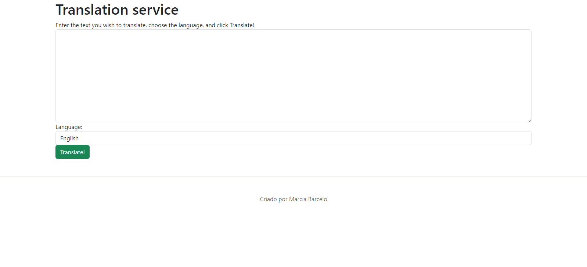
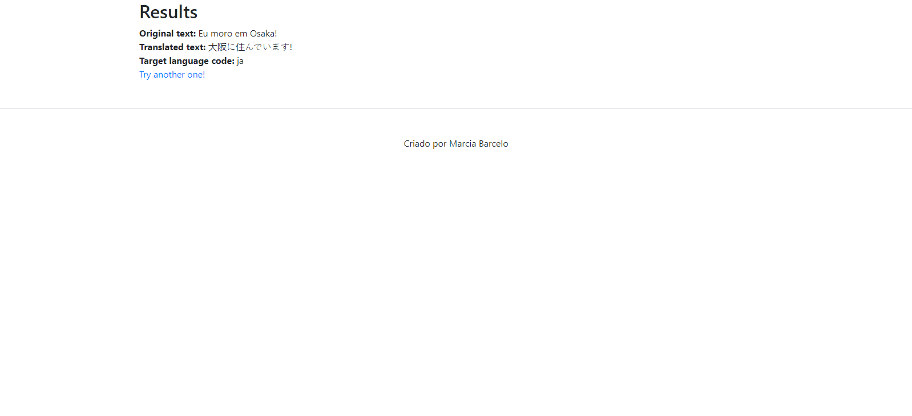

# Translator Web App
  

  

## Overview
This web app allows users to translate text into different languages using an AI-powered translation service. It is built using Flask for creating a web app with AI capabilities.

## Features
- Translate text into multiple languages.
- User-friendly interface with Bootstrap styling.
- Built with Flask for easy deployment and extensibility.

## Getting Started

### Prerequisites
- Python 3.x
- Flask library

### Installation
1. Clone the repository:
   ```bash
   git clone https://github.com/Mpbarcelo/web-app-ia
   cd web-app-ia
